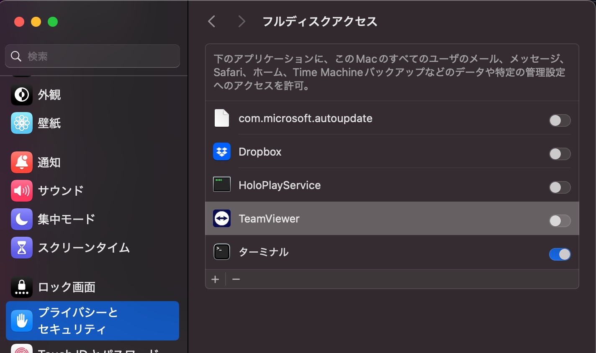

# voice2memo
 Audio Transcription & Apple Notes Integration Script


このスクリプトは、指定したディレクトリ内の音声ファイル（m4a形式）を自動で処理し、以下の一連の作業を行います。

iPhoneのボイスメモアプリをiCloudで同期するようにして、さらにiPhoneのボタン長押しショートカットでボイスメモの録音を立ち上げるようにしておくと、
- iPhoneでボタン長押し→音声入力→テキスト書き起こしがメモアプリに反映
ができるようになります。

1. **音声変換**  
   - `ffmpeg` を利用して、音声ファイル（m4a）を16kHz、モノラルのwavファイルに変換します。

2. **文字起こし**  
   - OpenAIの Whisper を利用した `whisper-cli` により、wavファイルから日本語の文字起こしを行い、テキストファイルとして出力します。
   - 使用するモデルファイルは、スクリプト内の `MODEL` 変数で指定します。

3. **テキスト整形**  
   - 文字起こし結果の改行コードを Notes アプリ用に整形（`\n` を `\r` に変換）します。

4. **Apple Notesへの登録**  
   - AppleScript（`osascript` 経由）を使用して、文字起こし結果を Apple Notes アプリ（メモアプリ）の新規ノートとして iCloud アカウントに登録します。  
   - ノートのタイトルは文字起こしテキストの1行目、本文は2行目以降（及び録音日時情報）となります。

---
## iPhone側の設定

アクションボタン（サイドボタン）の長押しでボイスメモが立ち上がるようにする：
- ホーム画面にある「設定」をタップ
- 「アクションボタン」を選択
- サイトボタンの画面を左右にスワイプしボイスメモを選択

ボイスメモとメモをiCloudに保存するように設定する。
- 「設定」「iCloud」「iCloudに保存」でボイスメモ、メモをオンにしておく。

## mac側の設定

mac上で、ボイスメモの格納ディレクトリにシェルScriptがアクセスできるようにしてください：

    アップルメニュー＞システム設定...>プライバシーとセキュリティ>フルディスクアクセス

    にターミナルを追加してアクセス許可する：



ffmpeg や whisper-cli が正しくインストールされ、パスが通っていることを確認してください。
- **whisper-cli** 
    ```bash
    pip install whisper-cli
    ```
詳しくは： https://github.com/vatsalaggarwal/whisper-cli

- **ffmpeg**  
  音声ファイルのフォーマット変換に使用します。  
  インストール例 (macOSの場合):  
  ```bash
  brew install ffmpeg
  ```

Configuration 以下のパスを自分の環境に合わせて変更してください

```bash
AUDIO_DIR="/Users/USER/Library/Group Containers/group.com.apple.VoiceMemos.shared/Recordings"
TRANSCRIBE_DIR="/Users/USER/..."  # 文字起こし結果を保存するディレクトリ（例: テキストファイル保存先）
TEMP_DIR="/tmp/transcribe"         # 一時ファイル用ディレクトリ
MODEL=/.../whisper.cpp/models/ggml-large-v3-turbo-q5_0.bin  # Whisperモデルファイルのパス
```

## 実行
```bash
$ ./transcribe_and_post.sh
```

で、ボイスメモがテキスト起こしされてメモアプリに追加されます。

(c) Jun Rekimoto